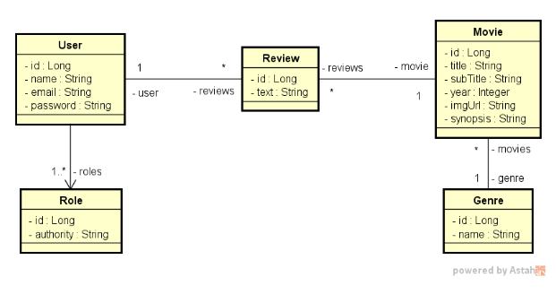

## 📦 TAREFA: MovieFlix casos de uso

### Visão geral do sistema MovieFlix
O sistema MovieFlix consiste em um banco de filmes, os quais podem ser listados e avaliados pelos usuários. Usuários
podem ser visitantes (VISITOR) e membros (MEMBER). Apenas usuários membros podem inserir avaliações no sistema.

Ao acessar o sistema, o usuário deve fazer seu login. Apenas usuários logados podem navegar nos filmes. Logo após fazer
o login, o usuário vai para a listagem de filmes, que mostra os filmes de forma paginada, ordenados alfabeticamente por título. O usuário pode filtrar os filmes por gênero.

Ao selecionar um filme da listagem, é mostrada uma página de detalhes, onde é possível ver todas informações do filme,
e também suas avaliações. Se o usuário for MEMBER, ele pode ainda registrar uma avaliação nessa tela.

Um usuário possui nome, email e senha, sendo que o email é seu nome de usuário. Cada filme possui um título, subtítulo,
uma imagem, ano de lançamento, sinopse, e um gênero. Os usuários membros podem registrar avaliações para os filmes. Um mesmo usuário membro pode deixar mais de uma avaliação para o mesmo filme.

### Modelo conceitual

### Casos de uso
#### Efetuar login
    [IN] O usuário anônimo informa seu email e senha
    [OUT] O sistema informa um token válido

#### Listar filmes

    [OUT] O sistema apresenta uma listagem dos nomes de todos gêneros, bem como uma listagem paginada com título,
    subtítulo, ano e imagem dos filmes, ordenada alfabeticamente por título.
    [IN] O usuário visitante ou membro seleciona, opcionalmente, um gênero.
    [OUT] O sistema apresenta a listagem atualizada, restringindo somente ao gênero selecionado.

#### Visualizar detalhes do filme

    [IN] O usuário visitante ou membro seleciona um filme
    [OUT] O sistema informa título, subtítulo, ano, imagem e sinopse do filme, e também uma listagem dos textos das
    avaliações daquele filme juntamente com nome do usuário que fez cada avaliação.
    [IN] O usuário membro informa, opcionalmente, um texto para avaliação do filme.
    [OUT] O sistema apresenta os dados atualizados, já aparecendo também a avaliação feita pelo usuário.

    Exceção 3.1 - Texto vazio
    3.1.1. O sistema apresenta uma mensagem de que não é permitido texto vazio na avaliação 

